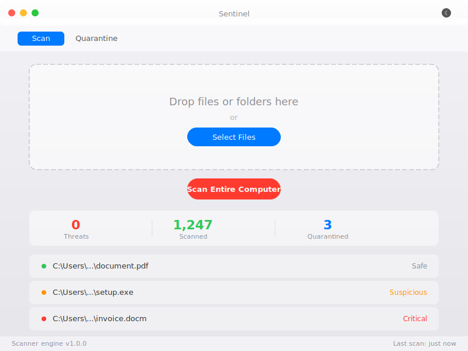

# Sentinel

A beautiful Apple-inspired virus scanner for Windows. Full system scan, quarantine, and secure file wiping.



## Features

- **Quick Scan** — Drag & drop files or folders, or select them via the file picker
- **Full System Scan** — Scans all drives on your computer
- **Quarantine** — Suspicious files are moved to a central quarantine for review
- **Secure Wipe** — Overwrites file contents before deletion (prevents recovery)
- **Apple-inspired UI** — Frosted title bar, SF font stack, traffic light controls
- **Dark / Light mode** — Toggle via the sun/moon icon in the title bar
- **Danger Dialogs** — Per-file review for high/critical threats: Ignore, Quarantine, or Wipe

## How it works

Sentinel uses a Python-based scanning engine that detects:
- YARA-like pattern matching (encoded PowerShell, embedded PEs, base64 blobs, etc.)
- Entropy analysis (packed/encrypted files)
- PE analysis (suspicious sections, imports, resources)
- Heuristics (macro documents, suspicious scripts, null-byte ratio, URLs)
- Hash lookup (known malware)
- If a threat is found, you get a dialog to **Ignore**, **Quarantine**, or **Wipe** the file.

## Download

Grab the latest installer from [Releases](https://github.com/yourusername/sentinel/releases).

## Build from source

```bash
git clone https://github.com/yourusername/sentinel.git
cd sentinel
npm install
npm run build:win
```

The installer will be in `dist/Sentinel-Setup-1.0.0.exe`.

## Requirements

- Windows 10 or later
- Python 3.12+ (bundled installer coming soon)

## License

MIT
